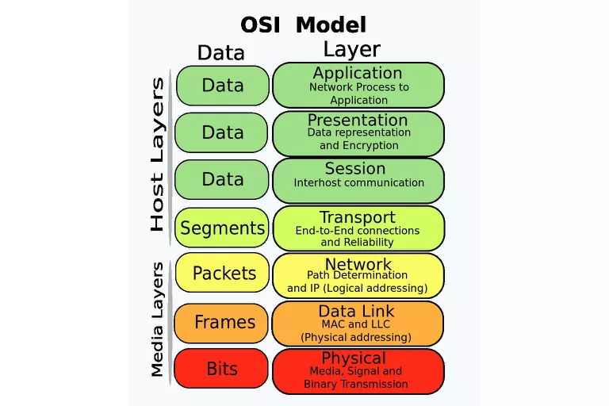

layout: true

.signature[@algogrit]

---

class: center, middle

# Network Virtualization

Gaurav Agarwal

---
class: center, middle

## Who is this class for?

---

- Experienced network engineers

- SRE & devops engineers

- Security engineers

---
class: center, middle

## What are we going to learn?

---
class: center, middle

*Outline*

---

class: center, middle

Software Engineer & Product Developer

Principal Consultant & Founder @ https://codermana.com

ex-Tarka Labs, ex-BrowserStack, ex-ThoughtWorks

---

class: center, middle

*What we wanted*

---

class: center, middle

*What we got*

---

## As a instructor

- I promise to

  - make this class as interactive as possible

  - use as many resources as available to keep you engaged

  - ensure everyone's questions are addressed

---

## What I need from you

- Be vocal

  - Let me know if there any audio/video issues ASAP

  - Feel free to interrupt me and ask me questions

- Be punctual

- Give feedback

- Work on the exercises

- Be *on mute* unless you are speaking

---
class: center, middle

## Class Progression

---
class: center, middle

---
class: center, middle

Here you are trying to *learn* something, while here your *brain* is doing you a favor by making sure the learning doesn't stick!

---

### Some tips

- Slow down => stop & think
  - listen for the questions and answer

- Do the exercises
  - not add-ons; not optional

- There are no dumb questions!

- Drink water. Lots of it!

---

### Some tips (continued)

- Take notes
  - Try: *Repetitive Spaced Out Learning*

- Talk about it out loud

- Listen to your brain

- *Experiment!*

---
class: center, middle

### 📚 Content ` > ` 🕒 Time

---
class: center, middle

## Show of hands

*Yay's - in Chat*

---
class: center, middle

Let's chart with...

---
class: center, middle

## OSI Model

---
class: center, middle

---
class: center, middle

OSI Model (Open Systems Interconnection Model) is a *conceptual* framework used to describe the functions of a networking system.

---
class: center, middle

OSI model characterizes computing functions into a universal set of rules and requirements in order to support interoperability between different products and software.

---
class: center, middle

In the OSI reference model, the communications between a computing system are split into seven different abstraction layers: Physical, Data Link, Network, Transport, Session, Presentation, and Application.

---
class: center, middle

Layers in the OSI model are ordered from ​the lowest layer to highest. Together, these layers comprise the OSI stack. The stack contains seven layers in two groups!

---

### Upper Layers

OSI designates the Application, Presentation, and Session stages of the stack as the upper layers. Generally speaking, software in these layers perform application-specific functions like data formatting, encryption, and connection management.

7: Application

6: Presentation

5: Session

---

### Lower Layers

The remaining lower layers of the OSI model provide more primitive network-specific functions like routing, addressing, and flow control.

4: Transport

3: Network

2: Data Link

1: Physical

---
class: center, middle

### Physical Layer (Layer 1)

---
class: center, middle

Lowest layer of the OSI Model is concerned with electrically or optically transmitting raw unstructured data bits across the network from the physical layer of the sending device to the physical layer of the receiving device.

---

Specifications such as:

- voltages

- pin layout

- cabling

- radio frequencies

---

Functions of the physical layer are:

- Bit synchronization

- Bit rate control

- Physical topologies

- Transmission mode

---

"physical" resources such as

- network hubs

- cabling

- repeaters

- network adapters

- modems

---
class: center, middle

### Data Link Layer (Layer 2)

---
class: center, middle

In Data link layer, directly connected nodes are used to perform node-to-node data transfer where data is packaged into frames.

---
class: center, middle

Data link layer also corrects errors that may have occurred at the physical layer.

---

Two sub-layers:

- Media Access Control (MAC)

- Logical Link Control (LLC)

---
class: center, middle

*MAC* provides flow control and multiplexing for device transmissions over a network.

---
class: center, middle

*LLC*, provides flow and error control over the physical medium as well as identifies line protocols.

---
class: center, middle

The packet received from Network layer is further divided into frames depending on the frame size of NIC (Network Interface Card).

---
class: center, middle

The Receiver’s MAC address is obtained by placing an *ARP*.

---

Functions of the Data Link layer are:

- Framing

- Physical addressing

- Error control

- Flow Control

- Access control

---
class: center, middle

### Network Layer (Layer 3)

---
class: center, middle

Responsible for receiving frames from the data link layer, and delivering them to their intended destinations based on the addresses contained inside the frame.

---
class: center, middle

Network layer finds the destination by using logical addresses, such as IP (internet protocol).

---
class: center, middle

At this layer, *routers* & *switches* are a crucial component used to quite literally route information where it needs to go between networks.

---

Functions of the Network layer are:

- Routing

- Logical Addressing

---
class: center, middle

### Transport Layer (Layer 4)

---
class: center, middle

Transport layer manages the delivery and error checking of data packets.

---

Regulates

- size

- sequencing

- and ultimately the transfer of data between systems and hosts

---

Functions of the transport layer are:

- Segmentation and Reassembly

- Service Point Addressing

---

Services provided by the transport layer:

- Connection Oriented Service: It is a three-phase process which include

  – Connection Establishment

  – Data Transfer

  – Termination / disconnection

- Connection less service

---
class: center, middle

### Session Layer (Layer 5)

---
class: center, middle

Session layer controls the conversations between different computers.

---
class: center, middle

A session or connection between machines is set up, managed, and termined at layer 5. Session layer services also include authentication and reconnections.

---

Functions of the session layer are:

- Session establishment, maintenance and termination

- Synchronization

- Dialog Controller

---
class: center, middle

### Presentation Layer (Layer 6)

---
class: center, middle

Presentation layer formats or translates data for the application layer based on the syntax or semantics that the application accepts.

---
class: center, middle

also called the *syntax* layer

---

Functions of the presentation layer are:

- Translation

- Encryption/ Decryption

---
class: center, middle

### Application Layer (Layer 7)

---
class: center, middle

At this layer, both the end user and the application layer interact directly with the software application.

---
class: center, middle

Application layer identifies communication partners, resource availability, and synchronizes communication.

---

Functions of the Application layer are:

- Network Virtual Terminal

- *FTAM-File transfer* access and management

- Mail Services

- Directory Services

---
class: center, middle

---
class: center, middle

OSI model acts as a reference model and is not implemented in the Internet because of its late invention. Current model being used is the *TCP/IP* model.

---
class: center, middle

## Internet protocol suite

---
class: center, middle

Internet protocol suite provides end-to-end data communication specifying how data should be packetized, addressed, transmitted, routed, and received.

---

Four abstraction layers:

- Link Layer

- Internet Layer

- Transport Layer

- Application Layer

---
class: center, middle

---
class: center, middle

The end-to-end principle has evolved over time. Its original expression put the maintenance of state and overall intelligence at the edges, and assumed the Internet that connected the edges retained no state and concentrated on speed and simplicity. Real-world needs for firewalls, network address translators, web content caches and the like have forced changes in this principle.

---
class: center, middle

The robustness principle states: "In general, an implementation must be conservative in its sending behavior, and liberal in its receiving behavior. That is, it must be careful to send well-formed datagrams, but must accept any datagram that it can interpret (e.g., not object to technical errors where the meaning is still clear)."

---
class: center, middle

"The second part of the principle is almost as important: software on other hosts may contain deficiencies that make it unwise to exploit legal but obscure protocol features."

---
class: center, middle

Encapsulation is used to provide abstraction of protocols and services. Encapsulation is usually aligned with the division of the protocol suite into layers of general functionality. In general, an application (the highest level of the model) uses a set of protocols to send its data down the layers. The data is further encapsulated at each level.

---
class: center, middle

### Application Layer aka Layer 7

---
class: center, middle

Application layer is the scope within which applications, or processes, create user data and communicate this data to other applications on another or the same host.

---

- Applications make use of the services provided by the underlying lower layers, especially the transport layer which provides reliable or unreliable pipes to other processes.

- Communications partners are characterized by the application architecture, such as the client–server model and peer-to-peer networking.

---
class: center, middle

This is the layer in which all application protocols, such as SMTP, FTP, SSH, HTTP, operate. Processes are addressed via ports which essentially represent services.

---
class: center, middle

*Demo*: Simple client/server application

---
class: center, middle

### Transport Layer aka Layer 4

---
class: center, middle

Transport layer performs host-to-host communications on either the local network or remote networks separated by routers.

---
class: center, middle

It provides a channel for the communication needs of applications.

---
class: center, middle

UDP is the basic transport layer protocol, providing an unreliable connectionless datagram service.

---
class: center, middle

Transmission Control Protocol provides flow-control, connection establishment, and reliable transmission of data.

---
class: center, middle

#### TCP vs UDP

---

- TCP is a connection-oriented protocol, whereas UDP is a connectionless protocol.

- The speed for TCP is slower while the speed of UDP is faster

- TCP uses handshake protocol like SYN, SYN-ACK, ACK while UDP uses no handshake protocols

- TCP does error checking and also makes error recovery, on the other hand, UDP performs error checking, but it discards erroneous packets.

- TCP has acknowledgment segments, but UDP does not have any acknowledgment segment.
When we compare TCP vs UDP protocol, TCP is heavy-weight, and UDP is lightweight.

---
class: center, middle

*Demo*: Echo TCP/UDP Server

---
class: center, middle

### Internet Layer aka Layer 3

---
class: center, middle

Internet layer exchanges datagrams across network boundaries. It provides a uniform networking interface that hides the actual topology (layout) of the underlying network connections.

---
class: center, middle

It is therefore also the layer that establishes internetworking.

---
class: center, middle

It defines and establishes the Internet.

---
class: center, middle

Defines the addressing and routing structures used for the TCP/IP protocol suite.

---
class: center, middle

The primary protocol in this scope is the Internet Protocol, which defines IP addresses. Its function in routing is to transport datagrams to the next host that has the connectivity to a network closer to the final data destination.

---
class: center, middle

*Demo*: IP Sockets

---
class: center, middle

*Related*: DHCP (Dynamic Host Configuration Protocol)

---
class: center, middle

### Link Layer

---
class: center, middle

The link layer defines the networking methods within the scope of the local network link on which hosts communicate without intervening routers.

---
class: center, middle

This layer includes the protocols used to describe the local network topology and the interfaces needed to affect the transmission of Internet layer datagrams to next-neighbor hosts.

---
class: center, middle

*Related*: ARP (Address Resolution Protocol)

---
class: center, middle

### Anatomy of a network packet

.content-credits[https://www.tigera.io/lp/kubernetes-networking-ebook/]

---
class: center, middle

Let's zoom into the Internet Layer... Specifically Addressing...

---
class: center, middle

## IP Addressing

---

---
class: center, middle

Code
https://github.com/AgarwalConsulting/NWVirt-Training

Slides
https://cilium.slides.agarwalconsulting.io/
