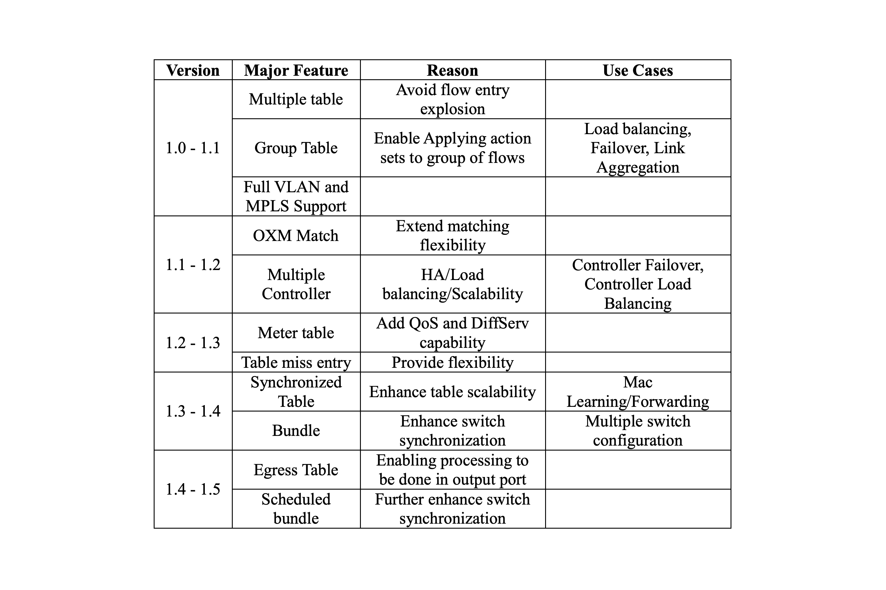

layout: true

.signature[@algogrit]

---

class: center, middle

# SDN & Network Virtualization

Gaurav Agarwal

---
class: center, middle

## Who is this class for?

---

- Experienced network engineers

- SRE & devops engineers

- Security engineers

---
class: center, middle

## What are we going to learn?

---
class: center, middle

*Outline*

---

class: center, middle


Software Engineer & Product Developer

Principal Consultant & Founder @ https://codermana.com

ex-Tarka Labs, ex-BrowserStack, ex-ThoughtWorks

---

class: center, middle

*What we wanted*


---

class: center, middle

*What we got*


---

## As a instructor

- I promise to

  - make this class as interactive as possible

  - use as many resources as available to keep you engaged

  - ensure everyone's questions are addressed

---

## What I need from you

- Be vocal

  - Let me know if there any audio/video issues ASAP

  - Feel free to interrupt me and ask me questions

- Be punctual

- Give feedback

- Work on the exercises

- Be *on mute* unless you are speaking

---
class: center, middle

## Class Progression

---
class: center, middle


---
class: center, middle

Here you are trying to *learn* something, while here your *brain* is doing you a favor by making sure the learning doesn't stick!

---

### Some tips

- Slow down => stop & think
  - listen for the questions and answer

- Do the exercises
  - not add-ons; not optional

- There are no dumb questions!

- Drink water. Lots of it!

---

### Some tips (continued)

- Take notes
  - Try: *Repetitive Spaced Out Learning*

- Talk about it out loud

- Listen to your brain

- *Experiment!*

---
class: center, middle

### 📚 Content ` > ` 🕒 Time

---
class: center, middle

## Show of hands

*Yay's - in Chat*

---
class: center, middle

Let's start with...

---
class: center, middle

## OSI Model

---
class: center, middle


---
class: center, middle

OSI Model (Open Systems Interconnection Model) is a *conceptual* framework used to describe the functions of a networking system.

---
class: center, middle

OSI model characterizes computing functions into a universal set of rules and requirements in order to support interoperability between different products and software.

---
class: center, middle

In the OSI reference model, the communications between a computing system are split into seven different abstraction layers: Physical, Data Link, Network, Transport, Session, Presentation, and Application.

---
class: center, middle

Layers in the OSI model are ordered from ​the lowest layer to highest. Together, these layers comprise the OSI stack. The stack contains seven layers in two groups!

---

### Upper Layers

OSI designates the Application, Presentation, and Session stages of the stack as the upper layers. Generally speaking, software in these layers perform application-specific functions like data formatting, encryption, and connection management.

7: Application

6: Presentation

5: Session

---

### Lower Layers

The remaining lower layers of the OSI model provide more primitive network-specific functions like routing, addressing, and flow control.

4: Transport

3: Network

2: Data Link

1: Physical

---
class: center, middle

### Physical Layer (Layer 1)

---
class: center, middle

Lowest layer of the OSI Model is concerned with electrically or optically transmitting raw unstructured data bits across the network from the physical layer of the sending device to the physical layer of the receiving device.

---

Specifications such as:

- voltages

- pin layout

- cabling

- radio frequencies

---

Functions of the physical layer are:

- Bit synchronization

- Bit rate control

- Physical topologies

- Transmission mode

---

"physical" resources such as

- network hubs

- cabling

- repeaters

- network adapters

- modems

---
class: center, middle

### Data Link Layer (Layer 2)

---
class: center, middle

In Data link layer, directly connected nodes are used to perform node-to-node data transfer where data is packaged into frames.

---
class: center, middle

Data link layer also corrects errors that may have occurred at the physical layer.

---

Two sub-layers:

- Media Access Control (MAC)

- Logical Link Control (LLC)

---
class: center, middle

*MAC* provides flow control and multiplexing for device transmissions over a network.

---
class: center, middle

*LLC*, provides flow and error control over the physical medium as well as identifies line protocols.

---
class: center, middle

The packet received from Network layer is further divided into frames depending on the frame size of NIC (Network Interface Card).

---
class: center, middle

The Receiver’s MAC address is obtained by placing an *ARP*.

---

Functions of the Data Link layer are:

- Framing

- Physical addressing

- Error control

- Flow Control

- Access control

---
class: center, middle

### Network Layer (Layer 3)

---
class: center, middle

Responsible for receiving frames from the data link layer, and delivering them to their intended destinations based on the addresses contained inside the frame.

---
class: center, middle

Network layer finds the destination by using logical addresses, such as IP (internet protocol).

---
class: center, middle

At this layer, *routers* & *switches* are a crucial component used to quite literally route information where it needs to go between networks.

---

Functions of the Network layer are:

- Routing

- Logical Addressing

---
class: center, middle

### Transport Layer (Layer 4)

---
class: center, middle

Transport layer manages the delivery and error checking of data packets.

---

Regulates

- size

- sequencing

- and ultimately the transfer of data between systems and hosts

---

Functions of the transport layer are:

- Segmentation and Reassembly

- Service Point Addressing

---

Services provided by the transport layer:

- Connection Oriented Service: It is a three-phase process which include

  – Connection Establishment

  – Data Transfer

  – Termination / disconnection

- Connection less service

---
class: center, middle

### Session Layer (Layer 5)

---
class: center, middle

Session layer controls the conversations between different computers.

---
class: center, middle

A session or connection between machines is set up, managed, and termined at layer 5. Session layer services also include authentication and reconnections.

---

Functions of the session layer are:

- Session establishment, maintenance and termination

- Synchronization

- Dialog Controller

---
class: center, middle

### Presentation Layer (Layer 6)

---
class: center, middle

Presentation layer formats or translates data for the application layer based on the syntax or semantics that the application accepts.

---
class: center, middle

also called the *syntax* layer

---

Functions of the presentation layer are:

- Translation

- Encryption/ Decryption

- Compression

---
class: center, middle

### Application Layer (Layer 7)

---
class: center, middle

At this layer, both the end user and the application layer interact directly with the software application.

---
class: center, middle

Application layer identifies communication partners, resource availability, and synchronizes communication.

---

Functions of the Application layer are:

- Network Virtual Terminal

- *FTAM-File transfer* access and management

- Mail Services

- Directory Services

---
class: center, middle


---
class: center, middle

OSI model acts as a reference model and is not implemented in the Internet because of its late invention. Current model being used is the *TCP/IP* model.

---
class: center, middle

## Local installation & Setup

---
class: center, middle

## Internet protocol suite

---
class: center, middle

Internet protocol suite provides end-to-end data communication specifying how data should be packetized, addressed, transmitted, routed, and received.

---

Four abstraction layers:

- Link Layer

- Internet Layer

- Transport Layer

- Application Layer

---
class: center, middle


---
class: center, middle

The end-to-end principle has evolved over time. Its original expression put the maintenance of state and overall intelligence at the edges, and assumed the Internet that connected the edges retained no state and concentrated on speed and simplicity. Real-world needs for firewalls, network address translators, web content caches and the like have forced changes in this principle.

---
class: center, middle

The robustness principle states: "In general, an implementation must be conservative in its sending behavior, and liberal in its receiving behavior. That is, it must be careful to send well-formed datagrams, but must accept any datagram that it can interpret (e.g., not object to technical errors where the meaning is still clear)."

---
class: center, middle

"The second part of the principle is almost as important: software on other hosts may contain deficiencies that make it unwise to exploit legal but obscure protocol features."

---
class: center, middle

Encapsulation is used to provide abstraction of protocols and services. Encapsulation is usually aligned with the division of the protocol suite into layers of general functionality. In general, an application (the highest level of the model) uses a set of protocols to send its data down the layers. The data is further encapsulated at each level.

---
class: center, middle

### Application Layer aka Layer 7

---
class: center, middle

Application layer is the scope within which applications, or processes, create user data and communicate this data to other applications on another or the same host.

---

- Applications make use of the services provided by the underlying lower layers, especially the transport layer which provides reliable or unreliable pipes to other processes.

- Communications partners are characterized by the application architecture, such as the client–server model and peer-to-peer networking.

---
class: center, middle

This is the layer in which all application protocols, such as SMTP, FTP, SSH, HTTP, operate. Processes are addressed via ports which essentially represent services.

---
class: center, middle

*Demo*: Simple client/server application

---
class: center, middle

### Transport Layer aka Layer 4

---
class: center, middle

Transport layer performs host-to-host communications on either the local network or remote networks separated by routers.

---
class: center, middle

It provides a channel for the communication needs of applications.

---
class: center, middle

UDP is the basic transport layer protocol, providing an unreliable connectionless datagram service.

---
class: center, middle

Transmission Control Protocol provides flow-control, connection establishment, and reliable transmission of data.

---
class: center, middle

#### TCP vs UDP

---

- TCP is a connection-oriented protocol, whereas UDP is a connectionless protocol.

- The speed for TCP is slower while the speed of UDP is faster

- TCP uses handshake protocol like SYN, SYN-ACK, ACK while UDP uses no handshake protocols

- TCP does error checking and also makes error recovery, on the other hand, UDP performs error checking, but it discards erroneous packets.

- TCP has acknowledgment segments, but UDP does not have any acknowledgment segment.
When we compare TCP vs UDP protocol, TCP is heavy-weight, and UDP is lightweight.

---
class: center, middle


---
class: center, middle

*Demo*: Echo TCP/UDP Server

---
class: center, middle

### Internet Layer aka Layer 3

---
class: center, middle

Internet layer exchanges datagrams across network boundaries. It provides a uniform networking interface that hides the actual topology (layout) of the underlying network connections.

---
class: center, middle

It is therefore also the layer that establishes internetworking.

---
class: center, middle

It defines and establishes the Internet.

---
class: center, middle

Defines the addressing and routing structures used for the TCP/IP protocol suite.

---
class: center, middle

The primary protocol in this scope is the Internet Protocol, which defines IP addresses. Its function in routing is to transport datagrams to the next host that has the connectivity to a network closer to the final data destination.

---
class: center, middle

*Demo*: IP Sockets

---
class: center, middle

*Related*: DHCP (Dynamic Host Configuration Protocol)

---
class: center, middle

### Link Layer

---
class: center, middle

The link layer defines the networking methods within the scope of the local network link on which hosts communicate without intervening routers.

---
class: center, middle

This layer includes the protocols used to describe the local network topology and the interfaces needed to affect the transmission of Internet layer datagrams to next-neighbor hosts.

---
class: center, middle

*Related*: ARP (Address Resolution Protocol)

---
class: center, middle

MAC addresses are recognizable as six groups of two hexadecimal digits, separated by hyphens, colons, or without a separator.

---
class: center, middle

Duplicate MAC Addresses separated by one or more routers is not a problem since the two devices won’t see each other and will use the router to communicate.

---
class: center, middle

### Anatomy of a network packet


.content-credits[https://www.tigera.io/lp/kubernetes-networking-ebook/]

---
class: center, middle

### Internet Protocol Suite fitted onto...

---
class: center, middle


---
class: center, middle

Let's zoom into the Internet Layer... Specifically Addressing...

---
class: center, middle

## IP Addressing

---
class: center, middle

## ~~IP Addressing~~ IPAM (IP Address Management)

---
class: center, middle

IPAM (IP Address Management) is the administration of DNS and DHCP, which are the network services that assign and resolve IP addresses to machines in a TCP/IP network.

---
class: center, middle

Simply put, IPAM is a means of planning, tracking, and managing the Internet Protocol address space used in a network.

---
class: center, middle

Most commonly, tools such as DNS and DHCP are used in tandem to perform this task, though true IPAM will glue these services together so that each is aware of changes in the other (for instance DNS knowing of the IP address taken by a client via DHCP, and updating itself accordingly).

---
class: center, middle

### DHCP (Dynamic Host Configuration Protocol)

---
class: center, middle

Eliminates the need for individually configuring network devices manually.

---
class: center, middle

### IPv4

---
class: center, middle

`IPv4` uses a 32-bit address space...

---
class: center, middle

... which provides 4,294,967,296 (2ˆ32) unique addresses.

---
class: center, middle

### CIDR (Classless Inter-Domain Routing)

---
class: center, middle

Classless inter-domain routing (CIDR) is a set of Internet protocol (IP) standards that is used to create unique identifiers for networks and individual devices.

---

#### CIDR Refresher

- 10.0.0.0/8

- 192.168.0.0/16

- 172.16.0.0/12

- 169.254.0.0/16

What do these values mean?

---
class: center, middle

A subnetwork or *subnet* is a logical subdivision of an IP network.

---
class: center, middle

`IPv4` reserves special address blocks for private networks (~18 million addresses) and multicast addresses (~270 million addresses).

---
class: center, middle

A multicast address enables a device to send a datagram to a specified set of hosts, known as a multicast group, in different subnetworks.

---
class: center, middle

The multicast addresses are in the range `224.0.0.0` through `239.255.255.255`.

---

##### Private IPv4 ranges

- **10.0.0.0/8**

- **192.168.0.0/16**

- **172.16.0.0/12**

---

*DHCP* consists of two network components:

- a centrally installed network DHCP server

- client instances of the protocol stack on each computer or device

---
class: center, middle

DHCP services exist for networks running Internet Protocol version 4 (IPv4), as well as version 6 (IPv6). The IPv6 version of the DHCP protocol is commonly called DHCPv6.

---
class: center, middle

### NAT (Network address translation)

---
class: center, middle

allow multiple devices to access the Internet through a single public address

---

- Hiding internal IP addresses from public knowledge

- Converting an IP address for an internal host into a different IP address

- Making the IP addresses of two different networks compatible

---

- Static (map) NAT

- Masquerade (hide) NAT

- Masquerade (port-mapped) NAT

---
class: center, middle

Static (map) network address translation (NAT) provides a one-to-one mapping of private IP addresses to public IP addresses. It allows you to map an IP address on your internal network to an IP address that you want to make public.

---
class: center, middle

Masquerade (hide) network address translation (NAT) enables you to hide the actual address of a personal computer private. NAT routes traffic from your personal computer to your system, which essentially makes the system the gateway for your personal computer.

---
class: center, middle

In port-mapped NAT, you can specify both the IP address and the port number to translate. This enables both your internal personal computer and the external workstation to initiate IP traffic. You can use port-mapped NAT if the external workstation (or client) needs to access workstations or systems inside your network. Only IP traffic that matches both the IP address and the port number is allowed to access.

---
class: center, middle

### IPv6

---
class: center, middle

`IPv6` uses a 128-bit address, theoretically allowing 2ˆ128, or approximately 3.4×1038 addresses.

---
class: center, middle

`IPv6` addresses are represented as eight groups, separated by colons, of four hexadecimal digits.

---
class: center, middle

### DNS

---
class: center, middle

The Domain Name System (DNS) is the phonebook of the Internet. Humans access information online through domain names.

---
class: center, middle

Domain Name System (DNS) is a hierarchical and decentralized naming system for computers, services, or other resources connected to the Internet or a private network.

---
class: center, middle

#### DNS server

---
class: center, middle

#### Record types

---

- A (Host address)

- AAAA (IPv6 host address)

- ALIAS (Auto resolved alias)

- CNAME (Canonical name for an alias)

- MX (Mail eXchange)

- NS (Name Server)

- PTR (Pointer)

- SOA (Start Of Authority)

- SRV (location of service)

- TXT (Descriptive text)

---
class: center, middle

And these were just the more common ones!

.content-credits[https://simpledns.plus/help/dns-record-types]

---

The 8 steps in a DNS lookup:

- A user types ‘example.com’ into a web browser and the query travels into the Internet and is received by a DNS recursive resolver.

- The resolver then queries a DNS root nameserver (.).

- The root server then responds to the resolver with the address of a Top Level Domain (TLD) DNS server (such as .com or .net), which stores the information for its domains. When searching for example.com, our request is pointed toward the .com TLD.

- The resolver then makes a request to the .com TLD.

- The TLD server then responds with the IP address of the domain’s nameserver, example.com.

- Lastly, the recursive resolver sends a query to the domain’s nameserver.

- The IP address for example.com is then returned to the resolver from the nameserver.

- The DNS resolver then responds to the web browser with the IP address of the domain requested initially.

---
class: center, middle

#### DNS caching

---
class: center, middle

*Demo*: Namecheap DNS

---
class: center, middle

## IP Routing

---
class: center, middle

IP Routing is an umbrella term for the set of protocols that determine the path that data follows in order to travel across multiple networks from its source to its destination.

---

- Data is routed from its source to its destination through a series of routers, and across multiple networks.

- The IP Routing protocols enable routers to build up a forwarding table that correlates final destinations with next hop addresses.

---

These protocols include:

- BGP (Border Gateway Protocol)

- IS-IS (Intermediate System - Intermediate System)

- OSPF (Open Shortest Path First)

- RIP (Routing Information Protocol)

---
class: center, middle

When an IP packet is to be forwarded, a router uses its forwarding table to determine the next hop for the packet's destination address, and forwards the packet appropriately.

---
class: center, middle

### Terminology

---
class: center, middle

#### AS (Autonomous System)

---
class: center, middle

The Internet, for the purpose of routing, is divided into Autonomous Systems (ASs).

---
class: center, middle

An AS is a group of routers that are under the control of a single administration and exchange routing information using a common routing protocol.

---
class: center, middle

*An autonomous system (AS) is a collection of connected Internet Protocol (IP) routing prefixes under the control of one or more network operators on behalf of a single administrative entity or *domain*, that presents a common and clearly defined routing policy to the Internet.*

---
class: center, middle

#### Ingress / Egress

---
class: center, middle

Ingress traffic is composed of all the data communications and network traffic originating from external networks and destined for a node in the host network.

---
class: center, middle

Egress is all traffic is directed towards an external network and originated from inside the host network.

---
class: center, middle


.image-credits[https://www.safdar.com/how-to/ingress-vs-egress-network-traffic.html]

---
class: center, middle

#### East-West Traffic

---
class: center, middle

East-West traffic indicates flow of data among devices within a specific data center.

---
class: center, middle

#### North-South Traffic

---
class: center, middle

Any communication between components of a data center and another system, which is physically out of the boundary of the data center, is referred to as north-south traffic.

---
class: center, middle

It is any traffic coming to a data center, or going out of it to another system.

---
class: center, middle


.image-credits[https://blog.gigamon.com/2016/10/04/visibility-is-the-best-disinfectant-for-ransomware/]

---
class: center, middle

#### Switch

---
class: center, middle

A switch is a device that filters and forwards network packets from one networking device (switch, router, computer, server, etc.) to another.

---
class: center, middle

#### ATM Switch

---
class: center, middle

ATM switches are high-speed packet switches designed to process and forward ATM cells.

---
class: center, middle

*works on packet switching technology to allow voice, data, image and video traffic over high speed single access circuit.*

---
class: center, middle

The resources available on an ATM switch are divided into *switchlets*, each of which encapsulates a subset of the physical ATM switch resources.

---
class: center, middle

#### Intra / Inter - Domain Routing

---
class: center, middle

Intra domain is any protocol in which *routing* algorithm works only within domains.

---
class: center, middle

Inter domain is any protocol in which *routing* algorithm works within and between domains.

---
class: center, middle


---
class: center, middle

#### IGP / EGP

---
class: center, middle

An interior gateway protocol (IGP) is a dynamic route update protocol used between routers that run on TCP/IP hosts within a single autonomous system.

---
class: center, middle

Exterior Gateway Protocol (EGP) is the mechanism that allows the exterior gateway of an autonomous system to share routing information with exterior gateways on other autonomous systems.

---

EGP has three major functions:

- Establish a set of neighbours

- Check status of neighbours (if they are alive/reachable)

- Inform neighbours the networks that reachable within their AS’s

---
class: center, middle

During the early days of the Internet, EGP was frequently used by research institutes, universities, government agencies and private organizations, to interconnect autonomous systems but was replaced by Border Gateway Protocol (BGP).

---
class: center, middle

## SDN

---
class: center, middle

Software-defined networking technology is an approach to network management that enables dynamic, programmatically efficient network configuration in order to improve network performance and monitoring, making it more like cloud computing than traditional network management.

---
class: center, middle

### Active Networks (Historical)

---
class: center, middle

Active networks are networks where the switches perform custom computations on packets, as the packets travel through those switches.

---

- Every router in the network performing some kind of tracing, or a program, on the packets as they travel through the routers

- Boxes in the network that perform firewalling function, proxying, application services and so forth

---
class: center, middle

2 different approaches to active networks.

---
class: center, middle

The first was a rather extreme approach, and that was essentially that every message, or every packet actually carried a program.

---
class: center, middle

Second, you can have programmable switches, that would, where code would be installed. These programmable switches then, would perform custom operations of processing functions, on packets, depending on values in the packet header field.

---
class: center, middle

### Need for SDN

---

- Central Control

- Programmability

- Observability

- Reduced costs

---
class: center, middle

a single network wide vantage point could allow operators to directly observe rather than infer network wide behavior, and importantly, evolve the infrastructure data and services independently from one another.

---
class: center, middle

SDN operates using Control & Data plane separation.

---
class: center, middle


---

#### Control Plane

- The control plane is responsible for the configuration of the network.

- Logic for controlling the forwarding behavior of the network.

- Eg. Routing protocols, network middlebox configuration, etc.

---

#### Data Plane

- The data plane is responsible for the actual forwarding of packets.

- Forwards according to the forwarding logic specified in the control plane.

- Eg. IP forwarding, Layer 2 switching, etc.

---
class: center, middle

#### Why separate the Control & Data plane?

---

- Independent evolution & development

- Control from high-level software program

---
class: center, middle

#### Where does the separation help?

---

- Data Centers

- Routing: More control over decision logic

- Enterprise networks

- Research networks

---
class: center, middle


---
class: center, middle

#### Challenges in separation?

---

- Scalability

  Once you separate the control elements from the forwarding elements. Its likely that a control element maybe responsible for many many forwarding elements and sometimes thousands of forwarding elements.

- Reliability or Security

  What happens if a controller fails or is compromised? Well we should hope that the forwarding elements continue forwarding traffic, business as usual. But once we've separated the brains of the network from the devices that are actually forwarding the traffic. Correct behavior is no longer guaranteed if a controller should be failed or compromised.

---
class: center, middle

Interdomain routing protocol, BGP is the most common protocol used in today's networks.

---
class: center, middle

But it artificially constrains routes

---

- Route selection is based on a fixed set of steps

- There are limited knobs to control inbound/outbound traffic

- Very difficult to incorporate other information

---

Examples where SDN is better

- Maintenance dry out

- Egress Selection

- Better BGP Security

---

- Data Centers costs

```
200,000 servers
Fanout of 20 -> 10,000 switches

Option 1: $5k vendor switch = $50M
Option 2: $1k commodity switch + SDN = $10M

Savings in 10 data centers = $400M
```

---

- Data center addressing

  - How to address the hosts in a data center?

    > *Layer 2*: Less config/admin, but bad scaling properties

    > *Layer 3*: Can use existing routing protocols but high administration overhead

  - How to get the best of both worlds?

---

- Solution: Separate controller

  - Topology-dependent MAC addressing

    > Intercept all ARP packets

    > Rewrite MAC for packets entering & exiting network

  - IP addressing for application compatibility

---
class: center, middle


---
class: center, middle

### Terminology (Revisited)

---
class: center, middle

#### Northbound/Southbound Interface

---
class: center, middle

The northbound interface conceptualizes the lower level details (e.g., data or functions) used by, or in, the component, allowing the component to interface with higher level layers.

---
class: center, middle

A northbound interface of a component is an interface that allows the component to communicate with a higher level component, using the latter component's southbound interface.

---
class: center, middle

A southbound interface decomposes concepts in the technical details, mostly specific to a single component of the architecture. Southbound interfaces are drawn at the bottom of an architectural overview.

---
class: center, middle

A southbound interface (SBI) is a component’s lower level interface layer.

---
class: center, middle

In software-defined networking (SDN), the southbound interface serves as the OpenFlow or alternative protocol specification. It allows a network component to communicate with a lower level component.

---
class: center, middle


---
class: center, middle

In architectural overviews, the northbound interface is normally drawn at the top of the component it is defined in; hence the name northbound interface.

---
class: center, middle

Before we begin configuring our controllers...

---
class: center, middle

## Mininet

.content-credits[https://github.com/mininet/mininet/wiki/Introduction-to-Mininet]

---
class: center, middle

### Topologies

---
class: center, middle


.image-credits[http://www.routereflector.com/2013/11/mininet-as-an-sdn-test-platform/]

---
class: center, middle


.image-credits[http://www.routereflector.com/2013/11/mininet-as-an-sdn-test-platform/]

---
class: center, middle


.image-credits[http://www.routereflector.com/2013/11/mininet-as-an-sdn-test-platform/]

---
class: center, middle


.image-credits[http://www.routereflector.com/2013/11/mininet-as-an-sdn-test-platform/]

---
class: center, middle


.image-credits[http://www.routereflector.com/2013/11/mininet-as-an-sdn-test-platform/]

---
class: center, middle

*Challenge*: Define your own [mininet topology](https://github.com/AgarwalConsulting/NWVirt-Training/tree/master/challenges/01-mininet)

.content-credits[https://github.com/AgarwalConsulting/NWVirt-Training/tree/master/examples/02-mininet]

---
class: center, middle

## OpenFlow

---
class: center, middle

OpenFlow (OF) is considered one of the first software-defined networking (SDN) standards.

---
class: center, middle

The original concept began at Stanford University in 2008 but has since been managed by the [Open Networking Foundation](https://opennetworking.org/).

---
class: center, middle

An SDN controller in SDN is the “brains” of the SDN network, relaying information to switches/routers “below” (via southbound APIs) and the applications and business logic “above” (via northbound APIs).

---
class: center, middle


---
class: center, middle

Open Flow manipulates flow tables and flow entries on network devices without the application directly connecting to the network devices.

---

- The application developer can use an API to communicate to the controller, and the controller takes care of the details needed to update the network devices flow tables.

- The beauty of SDN is in the Application layer.

- OpenFlow is one (of many) possible means to achieve the abstraction needed for SDN.

---
class: center, middle

### Benefits of OpenFlow

---

- Programmability

- Centralized Intelligence

- Abstraction

---
class: center, middle

### OpenFlow Specification

---
class: center, middle

The official protocol specification that determines the formats for messages between the controller and the switch.

---
class: center, middle

By December 2009, [Version 1.0](https://opennetworking.org/wp-content/uploads/2013/04/OpenFlow%20Table%20Type%20Patterns%20v1.0.pdf) of the OpenFlow switch specification was released.

---
class: center, middle

The first "official release" of the OpenFlow protocol specification that is implemented on all major hardware and software switches, including Open vSwitch.

---
class: center, middle

Most controllers also support the OpenFlow 1.0 specification.

---
class: center, middle

[Later specifications](https://opennetworking.org/software-defined-standards/specifications/)

---
class: center, middle


---
class: center, middle



---
class: center, middle

### Components of OpenFlow

---

- Controller

- OpenFlow Switches

---
class: center, middle

### How does OpenFlow work?

---
class: center, middle

OpenFlow controller communicates with switch over a secure channel

---

#### OpenFlow communication

- OpenFlow protocol defines message format

- Purpose of control channel: update flow table

- Switches listen on port `6634` (`<` v1.3.2) or `6654` (`>` v1.3.2)

- Logic is executed at controller

---

#### Flow Tables

- In an OpenFlow network, each OpenFlow switch contains at least 1 flow table and a set of flow entries within that table.

- Using the OpenFlow switch protocol, the controller can add, update, and delete flow entries in flow tables, both reactively (in response to packets) and proactively.

---
class: center, middle


---
class: center, middle

**Reactive Flow Entries** are created when the controller dynamically learns where devices are in the topology and must update the flow tables on those devices to build end-to-end connectivity.

---
class: center, middle

**Proactive Flow Entries** are programmed before traffic arrives. If it’s already known that two devices should or should not communicate, the controller can program these flow entries on the OpenFlow endpoints ahead of time.

---
class: center, middle


---

- Typically, you’ll have more than a single flow table, so it’s important to note that matching starts at the first flow table and may continue to additional flow tables of the pipeline.

- The packet will first start in table 0 and check those entries based on priority. Highest priority will match first (e.g. 200, then 100, then 1).

- If the flow needs to continue to another table, goto statement tells the packet to go to the table specified in the instructions.

---
class: center, middle


---
class: center, middle

Flow entries contain match fields, counters and instructions to apply to matched packets.

---
class: center, middle

]

---

#### Flow Actions

- Actions are applied to packets that match a flow entry.

- Actions include:

  - Forward

  - Drop

  - Modify

  - Enqueue

---

*Actions*: Forward

- All: Send out all interfaces, not including the incoming interface.

- Controller: Encapsulate & send to the controller.

- Local: Send to the switch's local networking stack.

- Table: Perform actions in flow table. Only for packet-out messages.

- In port: Send the packet out the input port.

- *Optional*: Normal forwarding, spanning tree

---

*Actions*: Drop

- A flow-entry with no specified action indicates that all matching packets should be dropped.

---

*Actions*: Modify

- Option to modify packet header values in the packet (e.g., VLAN ID)

  - Set VLAN ID, priority, etc.

  - Set destination IP address

---

*Actions*: Enqueue

- Send the packet through a queue attached to a port

---
class: center, middle

*Demo*: [Modifying/Accessing flow table entries](https://github.com/AgarwalConsulting/NWVirt-Training/tree/master/examples/03-of) using `dpctl`

---
class: center, middle


---
class: center, middle

There are two types of OpenFlow switches: OpenFlow-only, and OpenFlow-hybrid.

---

- **OpenFlow-only** switches are “dumb switches” having only a data/forwarding plane and no way of making local decisions. All packets are processed by the OpenFlow pipeline, and can not be processed otherwise.

- **OpenFlow-hybrid** switches are “smart switches” that have a data plane and a forwarding plane. The data plane is used to make local decisions, and the forwarding plane is used to forward packets.

---
class: center, middle

*Hybrid-switches* support both OpenFlow operation and normal Ethernet switching operation. This means you can use traditional L2 Ethernet switching, VLAN isolation, L3 routing, ACLs and QoS processing via the switch’s local control plane while interacting with the OpenFlow pipeline using various classification mechanisms.

---
class: center, middle

#### Open vSwitch (OVS)

.content-credits[https://www.openvswitch.org/]

---

##### Open vSwitch (History)

- When VMware created server virtualization the access layer changed from having to be connected to a physical switch to being able to connect to a virtual switch.

- This virtual switch is a software layer that resides in a server that is hosting virtual machines (VMs).

- VMs, and now also containers, such as Docker, have logical or virtual Ethernet ports.

---

- Open vSwitch was created by the team at Nicira, that was later acquired by VMware.

- OVS was intended to meet the needs of the open source community, since there was no a feature-rich virtual switch offering designed for Linux-based hypervisors, such as KVM and XEN.

- OVS has quickly become the de facto virtual switch for XEN environments, and it is now playing a large part in other open source projects, like OpenStack.

---
class: center, middle


---
class: center, middle

OVS supports NetFlow, sFlow, port mirroring, VLANs, LACP, etc.

---
class: center, middle

From a control and management perspective, Open vSwitch leverages OpenFlow and the [Open vSwitch Database (OVSDB)](https://www.sdxcentral.com/cloud/open-source/definitions/what-is-ovsdb/) management protocol, which means it can operate both as a soft switch running within the hypervisor, and as the control stack for switching silicon.

---

Other important ways OVS is incorporated in software-defined networking (SDN) include:

- OVS is used to implement the Open vSwitch SDN Controller.

- OVS is critical to many SDN deployments in data centers because it ties together all the virtual machines (VMs) within a hypervisor instance on a server

- It is the first entry point for all the VMs sending traffic to the network and is the ingress point into overlay networks running on top of physical networks in the data center

- Using OVS for virtual networking is considered the core element of many datacenter SDN deployments and the main use case is multi-tenant network virtualization

- OVS can also be used to direct traffic between network functions in service chaining use cases

---
class: center, middle

OVS differs from the commercial offerings from VMware and Cisco. One point worth noting about OVS is that there is not a native SDN Controller or manager, like the Virtual Supervisor Manager (VSM) in the Cisco 1000V or vCenter in the case of VMware’s distributed switch.

---
class: center, middle

Open vSwitch is meant to be controlled and managed by third party controllers and managers.

---
class: center, middle

### Terminology (OpenFlow)

---
class: center, middle

#### Controller overhead

---
class: center, middle

Typically refers to the overhead that results when a switch does not have a flow table entry for a packet, causing the packet to be sent to the controller for processing.

---
class: center, middle

#### Flow table caching

---
class: center, middle

The process by which flow table decisions are cached at the switch, to prevent all packets from having to be forwarded through the controller.

---
class: center, middle

#### Control channel

---
class: center, middle

The communications channel that an SDN controller uses to communicate with SDN-capable switches.

---
class: center, middle

#### OpenStack

---
class: center, middle

A cloud operating system that makes use of network virtualization and OpenFlow to present an abstraction of a logical pool of resources.

---

### OpenFlow Connection Sequence

- Switch can initiate the connection to the controller’s IP and default transport port (TCP `6633` pre-OpenFlow 1.3.2, TCP `6653` post), or a user-specified port.

- Controller can also initiate the connection request, but this isn’t common.

- TCP or TLS Connection Established

- Both send an `OFPT_HELLO` with a populated version field

- Both calculate the negotiated version to be used

- If this cannot be agreed upon an `OFPT_ERROR` message is sent

- If each support the version, the controller sends an `OFPT_FEATURES-REQUEST` to gather the Datapath ID of the switch, along with the switch’s capabilities.

---
class: center, middle

*Challenge*: Add entries using `dpctl` to allow hosts in tree topo (depth=2) to reach each other.

---
class: center, middle

### SDN/OpenFlow Controllers

---
class: center, middle

SDN controllers can simplify network management, handling all communications between applications and devices to effectively manage and modify network flows to meet changing needs.

---
class: center, middle

When the network control plane is implemented in software, rather than firmware, administrators can manage network traffic more dynamically and at a more granular level.

---
class: center, middle

An SDN controller relays information to the switches/routers (via southbound APIs) and the applications and business logic (via northbound APIs).

---
class: center, middle

OpenFlow controllers create a central control point to oversee a variety of OpenFlow-enabled network components.

---
class: center, middle

The OpenFlow protocol is designed to increase flexibility by eliminating proprietary protocols from hardware vendors.

---
class: center, middle

There are many different implementations of the OpenFlow specification. These are known as the OpenFlow controllers.

---

- *NOX/POX*

- *Ryu*

- *Floodlight*

- *OpenDaylight*

- Pyretic

- Frenetic

- Procera

- RouteFlow

- Trema

---

### Considerations for choosing a controller

- Programming Language (can affect performance)

- Learning curve

- User base & community support

- Focus

  - Southbound API

  - Northbound API / "Policy Layer"

  - Support for OpenStack

  - Education, Research or Production?

---
class: center, middle

#### NOX

.content-credits[https://github.com/noxrepo/nox]

---
class: center, middle

The first SDN controller was *NOX*, which was initially developed by *Nicira* Networks, alongside OpenFlow.

---

- Open Source, stable, widely used

- Two "flavors" of NOX

  - *NOX-Classic*: C++/Python. No longer supported

  - *NOX* (the "new NOX")

---

- "new NOX"

  - C++ only

  - Fast, clean codebase

  - Well maintained & supported

---

NOX supports OpenFlow v1.0

- A fork (CPqD) supports 1.1, 1.2, & 1.3

- Programming model

  - Controller registers for events

  - Programmer writes event handler

---

- Gives good performance

- Good

  - if you know C++

  - willing to use low-level facilities and semantics of OpenFlow

---
class: center, middle

#### POX

---
class: center, middle

Essentially NOX in Python

---
class: center, middle

Supports OpenFlow v1.0 only

.content-credits[https://noxrepo.github.io/pox-doc/html/#what-versions-of-openflow-does-pox-support]

---

- Advantages

  - Widely used, maintained, supported

  - Relatively easy to read and write code

- Disadvantages

  - Performance

---

- Rapid prototyping & experimentation

  - Research, experimentation, demonstrations

  - Learning concepts

---
class: center, middle

#### Ryu

---

- Open source Python controller

  - Ryu supports fully 1.0, 1.2, 1.3, 1.4, 1.5 and Nicira Extensions.

  - Works with OpenStack

- Aims to be an "Operating System" for SDN

.content-credits[https://ryu-sdn.org/]

---

- Advantages

  - OpenStack Integration, OpenFlow 1.2-1.5

- Disadvantages

  - Performance

---
class: center, middle

#### Floodlight

.content-credits[https://floodlight.atlassian.net/wiki/spaces/floodlightcontroller/pages/8650780/Floodlight+VM]

---

- Open-source Java controller

  - Supports OpenFlow v1.0

  - Fork from "Beacon" Java OpenFlow controller

  - Maintained by *Big Switch Networks*

---

- Advantages

  - Good documentation

  - Integration with REST API

  - Production-level, OpenStack/Multi-Tenant clouds

- Disadvantages

  - Steep learning curve

---

- You need production-level performance & support

- You will use the REST API to interact with the controller

---
class: center, middle

#### OpenDaylight

.content-credits[https://www.opendaylight.org/]

---

- Common industry supported platforms

  - Robust, extensible open source codebase

  - Common abstractions for northbound capabilities

---

- Advantages

  - Industry acceptance, integration with OpenStack, cloud applications, etc.

- Disadvantages

  - Complex, steep learning curve

---
class: center, middle

Similar to *HP VAN*

---
class: center, middle


---

Choice of controller is a trade-off between:

- Needs

- Programming Language

- Performance

---
class: center, middle

### Using SDN controllers to Customize control

---

- POX Controller & simple Mininet topology

- Two types of control

  - Hub

  - Learning switch

- We can use `dpctl`

---
class: center, middle

#### Setup POX

---
class: center, middle

*Demo*: [Hub](https://github.com/AgarwalConsulting/NWVirt-Training/tree/master/examples/03-of/pox/hub)

---
class: center, middle


---
class: center, middle


---
class: center, middle

*Demo*: [Learning Switch](https://github.com/AgarwalConsulting/NWVirt-Training/tree/master/examples/03-of/pox/learning)

---
class: center, middle

*Challenge*: [Firewall](https://github.com/AgarwalConsulting/NWVirt-Training/tree/master/challenges/02-controller)

---
class: center, middle

A *middlebox* is a computer networking device that transforms, inspects, filters, and manipulates traffic for purposes other than packet forwarding.

---

Examples of middleboxes include

- firewalls

- network address translators (NATs)

- load balancers

- and deep packet inspection (DPI) boxes.

---
class: center, middle


---
class: center, middle

## Network Virtualization

---
class: center, middle

In computing, network virtualization is the process of combining hardware and software network resources and network functionality into a single, software-based administrative entity, a virtual network.

---
class: center, middle

Network virtualization involves platform virtualization, often combined with resource virtualization.

---
class: center, middle

Network Virtualization refers to abstracting network resources that were traditionally delivered in hardware to software.

---
class: center, middle


---
class: center, middle

Network Virtualization can combine multiple physical networks to one virtual, software-based network, or it can divide one physical network into separate, independent virtual networks.

---

Network virtualization is categorized as:

- External virtualization

  - combining many networks or parts of networks into a virtual unit.

- Internal virtualization

  - providing network-like functionality to software containers on a single network server.

---
class: center, middle

Network virtualization software allows network administrators to move virtual machines across different domains without reconfiguring the network.

The software creates a network overlay that can run separate virtual network layers on top of the same physical network fabric.

---

### History (NV)

- Virtualization was first introduced in the 1970s – back in the days of mainframe computing. It was superseded in the 1980s/1990s by the invention of x86 servers, personal computers and a move to a distributed computing model.

- Network virtualization as a term first appeared around 2005/2006 and almost exclusively in Cisco marketing material where it was used to promote virtualization of an enterprise campus network to achieve multiple closed user groups on a single physical network.

---

- Reduce network provisioning time from weeks to minutes

- Achieve greater operational efficiency by automating manual processes

- Place and move workloads independently of physical topology

- Improve network security within the data center

---

### Components of Network Virtualization

Various equipment and software vendors offer network virtualization by combining any of the following:

- Network hardware, such as switches and network adapters, also known as network interface cards (NICs)

- Network elements, such as firewalls and load balancers

- Networks, such as virtual LANs (VLANs) and containers such as virtual machines (VMs)

- Network storage devices

- Network machine-to-machine elements, such as telecommunications devices

- Network mobile elements, such as laptop computers, tablet computers, and smartphones

- Network media, such as Ethernet and Fibre Channel

---

### Aspects of network that can be virtualized

- *Nodes*: Virtual Machines

- *Links*: Tunnels

- Storage

---

### Benefits

- Infrastructure utilization

- Scalability

- Agility

- Resilience

- Security

---
class: center, middle

### Related Technologies (NV)

---
class: center, middle

#### VLAN

---
class: center, middle

One example of network virtualization is virtual LAN (VLAN).

---

- VLANs (Virtual LANs) are logical grouping of devices in the same broadcast domain.

- VLANs are usually configured on switches by placing some interfaces into one broadcast domain and some interfaces into another.

- Each VLAN acts as a subgroup of the switch ports in an Ethernet LAN.

- VLANs can spread across multiple switches, with each VLAN being treated as its own subnet or broadcast domain.

---
class: center, middle

A VLAN acts like a physical LAN, but it allows hosts to be grouped together in the same broadcast domain even if they are not connected to the same switch.

---

##### Benefits of VLAN

- VLANs increase the number of broadcast domains while decreasing their size.

- VLANs reduce security risks by reducing the number of hosts that receive copies of frames that the switches flood.

- You can keep hosts that hold sensitive data on a separate VLAN to improve security.

- You can create more flexible network designs that group users by department instead of by physical location.

- Network changes are achieved with ease by just configuring a port into the appropriate VLAN.

---
class: center, middle

The following topology shows a network with all hosts inside the same VLAN:


---
class: center, middle

Without VLANs, a broadcast sent from host A would reach all devices on the network. Each device will receive and process broadcast frames, increasing the CPU overhead on each device and reducing the overall security of the network.

---
class: center, middle

By placing interfaces on both switches into a separate VLAN, a broadcast from host A would reach only devices inside the same VLAN, since each VLAN is a separate broadcast domain. Hosts in other VLANs will not even be aware that the communication took place.

---
class: center, middle


---

##### How VLAN works

- VLANs in networking are identified by a number.

- A Valid range is 1-4094. On a VLAN switch, you assign ports with the proper VLAN number.

- The switch then allows data which needs to be sent between various ports having the same VLAN.

- Since almost all networks are larger than a single switch, there should be a way to send traffic between two switches.

- One simple and easy way to do this is to assign a port on each network switch with a VLAN and run a cable between them.

---
class: center, middle


---
class: center, middle

VLAN separates broadcast domains by adding tags to network packets. VLANs allow network administrators to group hosts under the same switch or between different switches.

---
class: center, middle


---
class: center, middle

```bash
ip link add link eth0 name eth0.2 type vlan id 2
ip link add link eth0 name eth0.3 type vlan id 3
```

---
class: center, middle


---
class: center, middle

##### Types of VLANs

---
class: center, middle


---

- Port-Based VLAN

  Port-based VLANs groups virtual local area network by port. In this type of virtual LAN, a switch port can be configured manually to a member of VLAN.

  Devices that are connected to this port will belong to the same broadcast domain that is because all other ports are configured with a similar VLAN number.

- Protocol Based VLAN

  This type of VLAN processes traffic based on a protocol that can be used to define filtering criteria for tags, which are untagged packets.

  In this Virtual Local Area Network, the layer-3 protocol is carried by the frame to determine VLAN membership. It works in multi-protocol environments. This method is not practical in a predominately IP based network.

---

- MAC Based VLAN

  MAC Based VLAN allows incoming untagged packets to be assigned virtual LAN and, thereby, classify traffic depending on the packet source address. You define a Mac address to VLAN mapping by configuring mapping the entry in MAC to the VLAN table.

---
class: center, middle

To interconnect two different VLANs, you can use routers or Layer 3 switches.

---
class: center, middle

#### VXLAN

---
class: center, middle

`VXLAN` is an encapsulation protocol that provides data center connectivity using tunneling to stretch Layer 2 connections over an underlying Layer 3 network.

---
class: center, middle


---
class: center, middle

It is designed to solve the problem of limited VLAN IDs (4,096).

---

##### Benefits of using VXLANs

- You can theoretically create as many as 16 million VXLANs in an administrative domain (as opposed to 4094 VLANs).

- VXLANs provide network segmentation at the scale required by cloud builders to support very large numbers of tenants.

- With traditional Layer 2 networks you are constrained by Layer 2 boundaries and forced to create large or geographically stretched Layer 2 domains. VXLAN's functionality allows you to dynamically allocate resources within or between data centers and enables migration of virtual machines between servers that exist in separate Layer 2 domains by tunneling the traffic over Layer 3 networks.

---
class: center, middle

It uses `UDP` packets to wrap the `IP` packets.

.content-credits[https://www.juniper.net/us/en/research-topics/what-is-vxlan.html]

---
class: center, middle

##### Anatomy of a network packet (Revisited)


.content-credits[https://www.tigera.io/lp/kubernetes-networking-ebook/]

---
class: center, middle

An *overlay* network is a telecommunications network that is built on top of another network and is supported by its infrastructure. An *overlay* network decouples network services from the underlying infrastructure by encapsulating one packet inside of another packet.

---
class: center, middle

##### Anatomy of a overlay network packet


.content-credits[https://www.tigera.io/lp/kubernetes-networking-ebook/]

---
class: center, middle

The VXLAN tunneling protocol that encapsulates Layer 2 Ethernet frames in Layer 3 UDP packets, enables you to create virtualized Layer 2 subnets, or segments, that span physical Layer 3 networks. Each Layer 2 subnet is uniquely identified by a VXLAN network identifier (VNI) that segments traffic.

---
class: center, middle

VXLAN encapsulates a MAC frame in a UDP datagram for transport across an IP network, creating an overlay network or tunnel.

---
class: center, middle

VXLAN is typically deployed in data centers on virtualized hosts, which may be spread across multiple racks.

---

- Create VXLAN device

```bash
ip link add vxlan0 type vxlan id 42 group 239.1.1.1 dev eth1 dstport 4789
# ip link add vx0 type vxlan id 100 local 1.1.1.1 remote 2.2.2.2 dev eth0 dstport 4789
```

This creates a new device named vxlan0. The device uses the multicast
group 239.1.1.1 over eth1 to handle traffic for which there is no
entry in the forwarding table. The destination port number is set to
the IANA-assigned value of 4789. The Linux implementation of VXLAN
pre-dates the IANA's selection of a standard destination port number
and uses the Linux-selected value by default to maintain backwards
compatibility.

---

- Delete vxlan device

```bash
ip link delete vxlan0
```

- Show vxlan info

```bash
ip -d link show vxlan0
```

---
class: center, middle

The entity that performs the encapsulation and decapsulation of packets is called a VXLAN tunnel endpoint (VTEP).

---

It is possible to create, destroy and display the vxlan
forwarding table using the new bridge command.

- Create forwarding table entry

```bash
bridge fdb add to 00:17:42:8a:b4:05 dst 192.19.0.2 dev vxlan0
```

- Delete forwarding table entry

```bash
bridge fdb delete 00:17:42:8a:b4:05 dev vxlan0
```

- Show forwarding table

```bash
bridge fdb show dev vxlan0
```

---
class: center, middle

Open vSwitch is an example of a software-based virtual network switch that supports VXLAN overlay networks.

---
class: center, middle

#### GENEVE

---
class: center, middle

The stated goal of `GENEVE` is to define an encapsulation data format only.

---
class: center, middle

`GENEVE` encapsulated packets are designed to be transmitted via standard networking equipment. Packets are sent from one tunnel endpoint to one or more tunnel endpoints using either unicast or multicast addressing.

.content-credits[https://www.redhat.com/en/blog/what-geneve]

---
class: center, middle


---

- The GENEVE specification offers recommendations on ways to achieve efficient operation by avoiding fragmentation and taking advantage of ECMP (Equal-cost multi-path) and NIC hardware offload facilities.

- The specification also offers options on how to support differentiated services and explicit congestion notification.

- The data format supports all of the capabilities of VXLAN, NVGRE and STT, so eventually use of the three earlier formats may decline.

---

Transition to GENEVE will not be immediate. The other encapsulation methods have been in use for some time, and multiple methods can operate within the same system. However, GENEVE is being adopted as the default tunnelling protocol for OVN (Open Virtual Network) which in turn is being promoted as an implementation of OVS (OpenvSwitch) in future OpenStack releases.

---

- MACVLAN

- IPVLAN

- MACVTAP/IPVTAP

- MACsec

- VXCAN

- ...

.content-credits[https://developers.redhat.com/blog/2018/10/22/introduction-to-linux-interfaces-for-virtual-networking]

---

Overlay networks have the advantage of having minimal dependencies on the underlying network infrastructure, but have the downsides of:

- having a small performance impact compared to non-overlay networking, which you might want to avoid if running network intensive workloads

- workloads on the overlay are not easily addressable from the rest of the network. so NAT gateways or load balancers are required to bridge between the overlay and the underlay network for any ingress to, or egress from, the overlay.

.content-credits[https://www.tigera.io/lp/kubernetes-networking-ebook/]

---
class: center, middle

Nodes in the overlay network can be thought of as being connected by virtual or logical links, each of which corresponds to a path, perhaps through many physical links, in the underlying network.

---
class: center, middle

"Ossification" of the internet architecture

.content-credits[https://en.wikipedia.org/wiki/Protocol_ossification]

---
class: center, middle

#### VPN

---
class: center, middle

A virtual private network (VPN) extends a private network across a public network and enables users to send and receive data across shared or public networks as if their computing devices were directly connected to the private network.

---
class: center, middle


---
class: center, middle

A VPN is created by establishing a virtual point-to-point connection through the use of dedicated circuits or with tunneling protocols over existing networks. A VPN available from the public Internet can provide some of the benefits of a wide area network (WAN). From a user perspective, the resources available within the private network can be accessed remotely.

---
class: center, middle

VPN Classification


---
class: center, middle

A limitation of traditional VPNs is that they are point-to-point connections and do not tend to support broadcast domains; therefore, communication, software, and networking, which are based on layer 2 and broadcast packets, such as NetBIOS used in Windows networking, may not be fully supported as on a local area network.

---
class: center, middle

##### Network Virtualization vs VPN

---

- VPN is about creating a network pipe that is private, i.e., encrypted between the two end points of the VPN.

- Network virtualisation is about creating a virtual network topology over the physical one.

---
class: center, middle

Before we proceed...

---
class: center, middle

### What happens when I run a container and expose a port?

---
class: center, middle

```bash
docker run -d -p 80:80 nginx
```

---

#### Linux Network Namespaces

Network namespaces is a part of containerization technology that is used by the Linux kernel to provide isolation between containers.

It allows, for example, a container to have its own network stack, its own networking configuration, and its own routing configuration.

---

- The tool that is used to operate with `network ns`: `iproute2`

- Network namespaces are stored in `/var/run/netns`

- There are two types of network namespaces:

  - Root namespace `ip link`
  - Non-root namespace `ip netns .. ip link`

---
class: center, middle


.content-credits[https://www.youtube.com/watch?v=QMNbgmxmB-M]

---
class: center, middle


.content-credits[https://www.youtube.com/watch?v=l2BS_kuQxBA]

---
class: center, middle

Default docker networking mode: Bridge mode

---
class: center, middle

A `Linux bridge` is a virtual implementation of a physical switch inside of the Linux kernel.

It forwards packets between interfaces that are connected to it. It's usually used for forwarding packets on routers, on gateways, or between VMs and *network namespaces* on a host.

It forwards traffic basing itself on MAC addresses, which are in turn discovered dynamically by inspecting traffic.

---
class: center, middle

```bash
bridge add <container-id> /var/run/netns/<namespace>
```

---
class: center, middle


.content-credits[https://www.youtube.com/watch?v=Slce9Nu-NB0]

---
class: center, middle

*Demo*: `docker network`

---
class: center, middle

### What about Mininet?

.content-credits[https://github.com/wiki/mininet/mininet/pdf/mininet-hotnets2010-final.pdf]

---
class: center, middle

*Experiment*: [Docker-OVS Integration](https://bitbucket.org/snrism/containet)

---
class: center, middle

### What about tools like Kubernetes, Swarm, Mesos, etc?

---

*For each container that is created, a virtual ethernet device is attached to this bridge, which is then mapped to `eth0` inside the container, with an ip within the aforementioned network range. Note that this will happen for each host that is running Docker, without any coordination between the hosts. Therefore, the network ranges might collide.*

*Because of this, containers will only be able to communicate with containers that are connected to the same virtual bridge. In order to communicate with other containers on other hosts, they must rely on port-mapping. This means that you need to assign a port on the host machine to each container, and then somehow forward all traffic on that port to that container. What if your application needs to advertise its own IP address to a container that is hosted on another node? It doesn’t actually knows its real IP, since his local IP is getting translated into another IP and a port on the host machine. You can automate the port-mapping, but things start to get kinda complex when following this model.*

.content-credits[https://blog.octo.com/en/how-does-it-work-docker-part-2-swarm-networking/]

---
class: center, middle


.content-credits[https://www.youtube.com/watch?v=l2BS_kuQxBA]

---
class: center, middle

### Enter CNI


---

- Originated at `CoreOS` as part of `rkt` (deprecated)

- Now a CNCF project

---
class: center, middle

*CNI consists of a specification and libraries for writing plugins to configure network interfaces in Linux containers, along with a number of supported plugins. CNI concerns itself only with network connectivity of containers and removing allocated resources when the container is deleted. Because of this focus, CNI has a wide range of support and the specification is simple to implement.*

.content-credits[https://github.com/containernetworking/cni]

---
class: center, middle

CNI is used by container runtimes, such as Kubernetes (as shown below), as well as Podman, CRI-O, Mesos, and others.

*To avoid duplication, we think it is prudent to define a common interface between the network plugins and container execution: hence we put forward this specification, along with libraries for Go and a set of plugins.*

---

#### What does the CNI project consist of?

- CNI specifications - Documents what the configuration format is when you call the CNI plugin, what it should do with that information, and the result that plugin should return.

- Set of reference and example plugins - These can help you understand how to write a new plugin or how existing plugins might work. They are cloud-agnostic. These are limited functionality plugins and just for reference.

.content-credits[https://www.redhat.com/sysadmin/cni-kubernetes]

---

The container/pod initially has no network interface. The container runtime calls the CNI plugin with verbs such as ADD, DEL, CHECK, etc. ADD creates a new network interface for the container, and details of what is to be added are passed to CNI via JSON payload.

- Container Runtime must create network namespace
- Identify network the container must attach to
- Container Runtime to invoke Network Plugin (bridge) when container is `ADD`ed
- Container Runtime to invoke Network Plugin (bridge) when container is `DELETE`ed
- JSON format of the network configuration

.content-credits[https://www.youtube.com/watch?v=l2BS_kuQxBA]

---

#### Execution flow of the CNI plugins

- When the container runtime expects to perform network operations on a container, it (like the `kubelet` in the case of K8s) calls the CNI plugin with the desired command.

- The container runtime also provides related network configuration and container-specific data to the plugin.

- The CNI plugin performs the required operations and reports the result.

CNI is called twice by K8s (kubelet) to set up `loopback` and `eth0` interfaces for a pod.

Note: CNI plugins are executable and support ADD, DEL, CHECK, VERSION commands, as discussed above.

.content-credits[https://www.redhat.com/sysadmin/cni-kubernetes]

---

CNI must support:

- Command line arguments ADD/DEL/CHECK
- Parameters like: container id, network ns, etc...
- Must manage IP address assignment to PODs
- Must return results in a specific format

---
class: center, middle


.content-credits[https://www.youtube.com/watch?v=QMNbgmxmB-M]

---

Supported CNI plugins:

- Bridge
- VLAN
- IPVLAN
- MACVLAN
- WINDOWS
- Also IPAM plugins like: host-local, DHCP, ...

---

There are also 3rd party plugins:

- Weave by weaveworks
- Flannel by CoreOS
- Calico project
- NSX by VMWare
- **Cilium by Cilium Inc**

---

#### Why are there multiple plugins?

*CNI provides the specifications for various plugins. And as you know, networking is a complex topic with a variety of user needs. Hence, there are multiple CNI plugins that do things differently to satisfy various use cases.*

.content-credits[https://www.redhat.com/sysadmin/cni-kubernetes]

---
class: center, middle

*Disclaimer* Docker doesn't use CNI, it uses Container Network Model (CNM) aka *Libnetwork*

---
class: center, middle


.content-credits[https://www.youtube.com/watch?v=QMNbgmxmB-M]

---

#### Challenges

- Updates to existing network configuration?

- Every runtime needs a different plugin?

- Security & QoS policies?

---
class: center, middle

Kubernetes chose simplicity and skipped the dynamic port-allocation deal. It just assumes that all containers can communicate with each other without Network Address Translation (NAT), that all containers can communicate with each node (and vice-versa), and that the IP that a container sees for itself is the same that the other containers see for it

.content-credits[https://blog.octo.com/en/how-does-it-work-docker-part-2-swarm-networking/]

---
class: center, middle

Some of the newer CNI plugins depend on a kernel module.

---
class: center, middle

### eBPF

.content-credits[https://ebpf.io/]

---
class: center, middle

*A new Linux kernel technology called eBPF is at the foundation of several CNI plugins. It supports dynamic insertion of eBPF bytecode into the Linux kernel at various integration points such as: network IO, application sockets, and tracepoints to implement security, networking and visibility logic. eBPF is highly efficient and flexible.*

---
class: center, middle

eBPF is a Linux kernel bytecode interpreter originally introduced to filter network packets, e.g. tcpdump and socket filters.

---
class: center, middle

*eBPF stands for extended Berkeley Packet Filter.*

---
class: center, middle

eBPF is enabling visibility into and control over systems and applications at a granularity and efficiency that was not possible before. It does so in a completely transparent way, without requiring the application to change in any way. eBPF is equally well-equipped to handle modern containerized workloads as well as more traditional workloads such as virtual machines and standard Linux processes.

---

- It has since been extended with additional data structures such as hashtable and arrays as well as additional actions to support packet mangling, forwarding, encapsulation, etc.

- An in-kernel verifier ensures that eBPF programs are safe to run and a JIT compiler converts the bytecode to CPU architecture specific instructions for native execution efficiency. eBPF programs can be run at various hooking points in the kernel such as for incoming and outgoing packets.

- By relying on eBPF, all visibility is programmable and allows for a dynamic approach that minimizes overhead while providing deep and detailed visibility as required by users.

- eBPF continues to evolve and gain additional capabilities with each new Linux release.

---
class: center, middle


---
class: center, middle

BPF is a general purpose RISC instruction set and was originally designed for the purpose of writing programs in a subset of C which can be compiled into BPF instructions through a compiler back end (e.g. LLVM), so that the kernel can later on map them through an in-kernel JIT compiler into native opcodes for optimal execution performance inside the kernel.

---

#### Advantages of BPF

- Making the kernel programmable without having to cross kernel / user space boundaries. For example, BPF programs related to networking, as in the case of Cilium, can implement flexible container policies, load balancing and other means without having to move packets to user space and back into the kernel. State between BPF programs and kernel / user space can still be shared through maps whenever needed.

- Given the flexibility of a programmable data path, programs can be heavily optimized for performance also by compiling out features that are not required for the use cases the program solves. For example, if a container does not require IPv4, then the BPF program can be built to only deal with IPv6 in order to save resources in the fast-path.

---

#### Advantages of BPF (continued...)

- In case of networking (e.g. tc and XDP), BPF programs can be updated atomically without having to restart the kernel, system services or containers, and without traffic interruptions. Furthermore, any program state can also be maintained throughout updates via BPF maps.

- BPF provides a stable ABI towards user space, and does not require any third party kernel modules. BPF is a core part of the Linux kernel that is shipped everywhere, and guarantees that existing BPF programs keep running with newer kernel versions. This guarantee is the same guarantee that the kernel provides for system calls with regard to user space applications. Moreover, BPF programs are portable across different architectures.

---

#### Advantages of BPF (continued)

- BPF programs work in concert with the kernel, they make use of existing kernel infrastructure (e.g. drivers, netdevices, tunnels, protocol stack, sockets) and tooling (e.g. iproute2) as well as the safety guarantees which the kernel provides. Unlike kernel modules, BPF programs are verified through an in-kernel verifier in order to ensure that they cannot crash the kernel, always terminate, etc. XDP programs, for example, reuse the existing in-kernel drivers and operate on the provided DMA buffers containing the packet frames without exposing them or an entire driver to user space as in other models. Moreover, XDP programs reuse the existing stack instead of bypassing it. BPF can be considered a generic “glue code” to kernel facilities for crafting programs to solve specific use cases.

---
class: center, middle

*The execution of a BPF program inside the kernel is always event-driven!*

---

#### Events like

- A networking device which has a BPF program attached on its ingress path will trigger the execution of the program once a packet is received.

- A kernel address which has a `kprobe` with a BPF program attached will trap once the code at that address gets executed, which will then invoke the `kprobe`’s callback function for instrumentation, subsequently triggering the execution of the attached BPF program.

---
class: center, middle

#### Sample BPF program


.content-credits[https://www.youtube.com/watch?v=Kmm8Hl57WDU]

---
class: center, middle

e**X**press **D**ata **P**ath

---
class: center, middle

*The XDP BPF hook is at the earliest point possible in the networking driver and triggers a run of the BPF program upon packet reception.*

---
class: center, middle

This achieves the best possible packet processing performance since the program runs directly on the packet data before any other processing can happen. This hook is ideal for running filtering programs that drop malicious or unexpected traffic, and other common DDOS protection mechanisms.

*XDP is a further step in evolution of BPF and enables to run a specific flavor of BPF programs from the network driver with direct access to the packet's DMA buffer.*

---
class: center, middle


---

class: center, middle

#### Default Network path (Layer 1)


.content-credits[https://www.youtube.com/watch?v=Kmm8Hl57WDU]

---
class: center, middle

#### Default Network path (Layer 2)


.content-credits[https://www.youtube.com/watch?v=Kmm8Hl57WDU]

---
class: center, middle


*Networking programs in BPF, in particular for `tc` and `XDP` do have an offload-interface to hardware in the kernel in order to execute BPF code directly on the NIC.*

---
class: center, middle

#### Default Network path (Layer 2 & 3)


.content-credits[https://www.youtube.com/watch?v=Kmm8Hl57WDU]

---
class: center, middle

#### Default Network path (Layer 3 & 4)


.content-credits[https://www.youtube.com/watch?v=Kmm8Hl57WDU]

---
class: center, middle

#### Default Network path (Layer 4)


.content-credits[https://www.youtube.com/watch?v=Kmm8Hl57WDU]

---
class: center, middle

#### Default Network path (Layer 4 - User Space)


.content-credits[https://www.youtube.com/watch?v=Kmm8Hl57WDU]

---
class: center, middle


.content-credits[https://www.youtube.com/watch?v=Kmm8Hl57WDU]

---
class: center, middle


.content-credits[https://github.com/cilium/cilium#what-is-ebpf-and-xdp]

---
class: center, middle

Until 1 Gbit/s networks, Network virtualization was not suffering from the overhead of the software layers or hypervisor layers providing the interconnects. With the rise of high bandwidth, 10 Gbit/s and beyond, the rates of packets exceed the capabilities of processing of the networking stacks.

---
class: center, middle

In order to keep offering high throughput processing, some combinations of software and hardware helpers are deployed in the so-called "network in a box" associated with either a hardware-dependent network interface controller (NIC) using SRIOV extensions of the hypervisor or either using a fast path technology between the NIC and the payloads (virtual machines or containers).

---
class: center, middle

The main bypass technologies are either based on a limited set of features such as Open vSwitch (OVS) with its [DPDK](https://www.dpdk.org/) user space implementation or based on a full feature and offload of Linux processing such as [6WIND Virtual Accelerator](https://www.6wind.com/).

---
class: center, middle

OVS, also, directly supports eBPF.

.content-credits[https://docs.openvswitch.org/en/latest/intro/install/afxdp/]
<!-- .content-credits[http://vger.kernel.org/lpc_net2018_talks/ovs-ebpf-afxdp.pdf] -->

---
class: center, middle

### SDN & N/W Virtualization

---
class: center, middle

#### Slicing Network Control

---
class: center, middle

Network slicing divides the production network into logical slices, such that, each slice controls its own packet forwarding.

---
class: center, middle

]

---
class: center, middle

*FlowVisor* is an experimental software-defined networking (SDN) controller that enables network virtualization by dividing a physical network into multiple logical networks.

.content-credits[https://github.com/opennetworkinglab/flowvisor]

---

- FlowVisor is a special purpose OpenFlow controller that acts as a transparent proxy between OpenFlow switches and multiple OpenFlow controllers

- FlowVisor creates rich "slices" of network resources and delegates control of each slice to a different controller

- Slices can be defined by any combination of switch ports (layer 1), src/dst ethernet address or type (layer 2), src/dst IP address or type (layer 3), and src/dst TCP/UDP port or ICMP code/type (layer 4).

- FlowVisor enforces isolation between each slice, i.e., one slice cannot control another's traffic

---

From FlowVisor README:

> An OpenFlow controller that acts as a hypervisor/proxy between a switch and multiple controllers. Can slice multiple switches in parallel, effectively slicing a network.

---
class: center, middle

FlowVisor slices a physical network into abstracted units of bandwidth, topology, traffic and network device central processing units (CPUs). It operates as a transparent proxy controller between the physical switches of an OpenFlow network and other OpenFlow controllers and enables multiple controllers to operate the same physical infrastructure.

---

- The SDN research community considers FlowVisor an experimental technology, although Stanford University, a leading SDN research institution, has run FlowVisor in its production network since 2009.

- FlowVisor lacks some of the basic network management interfaces that would make it enterprise-grade.

- It currently has no command line interface or Web-based administration console.

- Instead, users make changes to the technology with configuration file updates.

---
class: center, middle

Code
https://github.com/AgarwalConsulting/NWVirt-Training

Slides
https://nw-virtualization.slides.agarwalconsulting.io/
